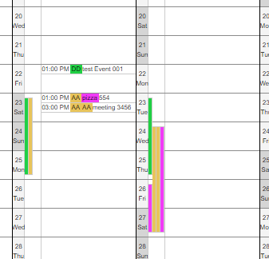

# YearlyCalendarApp
An application that can give you a detailed comprehensive yearly overviews of your calendar

||  |
|:---:|:---:|
| |  |

## Goals
* Eas of use
* Dense and comprehensively formatted data
* Customization

## Features
* 2 different overviews: one horizontal, the other one vertical
* Highlight colors
    * Words and sentences can be automatically highlighted
* Overview for multi day calendar entries
* Configurable
    * How many calendar entries to show per day, until the rest are hidden under a show more item
    * How many multi day entries are shown per day, until they are hidden under a show more item

## Compatability
* Platforms:
    * Windows
* Supported Calendars:
    * ~~IMAP~~
    * ~~Outlook.com~~
    * ~~Office 365 / Outlook / Exchange~~
    * ~~Microsoft Exchange Active Sync~~
    * ~~Microsoft Outlook local~~
    * ~~Google~~
    * ~~iCloud~~

## Installation
 